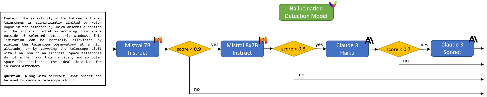

# FrugalBedrock 🍄

Learn how to implement FrugalGPT-style LLM cascades on top of [Amazon Bedrock](https://aws.amazon.com/bedrock/) to fight hallucinations.



## Instructions

1. Install dependencies

	```bash
	pip install -r requirements.txt
	```

2. Run script

	```bash
	python frugal_bedrock.py
	```

## References

### Articles 📝

* (Chen, Zaharia & Zou, 2023) [FrugalGPT: How to Use Large Language Models While Reducing Cost and Improving Performance](https://arxiv.org/abs/2305.05176)
* (Yue *et al.*, 2023) [Large Language Model Cascades with Mixture of Thoughts Representations for Cost-efficient Reasoning](https://arxiv.org/abs/2310.03094)

### Blogs ✍️

* (PortKey) [Implementing FrugalGPT: Reducing LLM Costs & Improving Performance](https://portkey.ai/blog/implementing-frugalgpt-smarter-llm-usage-for-lower-costs/)
* (Vectara) [Automating Hallucination Detection: Introducing the Vectara Factual Consistency Score](https://vectara.com/blog/automating-hallucination-detection-introducing-vectara-factual-consistency-score/)

### Code 👨‍💻

* [stanford-futuredata/FrugalGPT](https://github.com/stanford-futuredata/FrugalGPT/) - offers a collection of techniques for building LLM applications with budget constraints
* [MurongYue/LLM_MoT_cascade](https://github.com/MurongYue/LLM_MoT_cascade) - provides prompts, LLM results and code implementation for Yue *et al.* (2023)
 